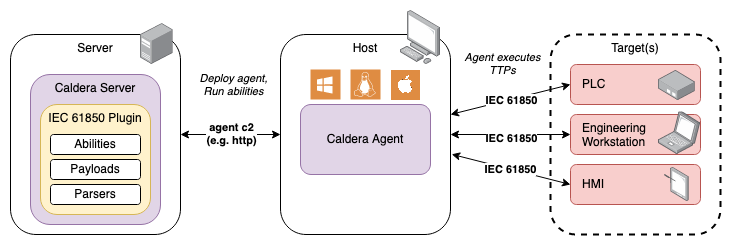

# IEC 61850

IEC 61850 Protocol Threat Emulation Tooling  
  
v1.0.1 released 25 Mar 2024  
Mapped to MITRE ATT&CK® for ICS [v14](https://attack.mitre.org/resources/updates/updates-october-2023/)

## Overview

The IEC 61850 plugin provides __16__ adversary emulation abilities specific to the IEC 61850 series of power utility automation standards. Adversary emulation is accomplished not through exploitation, but rather by leveraging native functionality defined by the IEC 61850 series. The IEC 61850 specification is available for purchase from the [International Electrotechnical Commission](https://webstore.iec.ch/publication/6028). The following table outlines MITRE ATT&CK for ICS Tactic coverage provided by the IEC 61850 plugin.

|[Collection](#collection-abilities) | [Inhibit Response Function](#inhibit-response-function)| [Impair Process Control](#impair-process-control) | 
|:----|:----|:----|
|Automated Collection| Data Destruction | Unauthorized Command Message |
|Point & Tag Identification| | Modify Parameter |
|Monitor Process State| | |

### IEC 61850 - MMS Relationship

The IEC 61850 specification defines an abstract data model and abstract services, which are independent of any particular protocol. This allows that data model and services to be mapped to any protocol capable of meeting the requirements of the specification.[^1]  

This plugin provides access to abstract services which utilize the Manufacturing Message Specification (MMS) protocol to implement those services and the IEC 61850 data model. This abstract service to function mapping is further detailed in the [table below](#iec-61850---mms-service-mapping).

### Compatibility
The plugin payload(s) currently support deployment to Caldera agents for the following computer architectures:

|      |Windows |Linux | Macintosh|
|-----:|:------:|:----:|:--------:|
|32-bit|        |      |          |
|64-bit|   X    |   X  |     X    |

- The Windows payload was compiled with:
    - compiler: GNU 13.1.0 (MinGW UCRT64)
    - cmake: version 3.27.4
    - platform: Windows-10-10.0.19044-SP0 (Windows 10 v21H2)
- The Linux payload was compiled with:
    - compiler: GNU 11.4.0
    - cmake: version 3.22.1
    - platform: linux-5.15.0-84-generic (Ubuntu 22.04.3 LTS)
- The Mac (Apple silicon) payload was compiled with:
    - compiler: AppleClang 15.0.0.15000100
    - cmake: version 3.28.0
    - platform: macOS-13.6-arm64-arm-64bit (macOS Ventura)

### Ability Overview Tables
The following table outlines MITRE ATT&CK for ICS Tactic coverage provided by this plugin. A heatmap of plugin abilities is available to view [here](assets/heatmap.png).

#### Collection Abilities

| Name 	                | Tactic 	        | Technique |  Technique ID     |
|---------              |---------	        |---------	|---------	        |
| [IEC 61850 - Get Logical Devices](#iec-61850---get-logical-devices) | Collection | Automated Collection | T0802 |   
| [IEC 61850 - Get Logical Nodes](#iec-61850---get-logical-nodes) | Collection | Automated Collection | T0802 |  
| [IEC 61850 - Get Data Objects](#iec-61850---get-data-objects) | Collection | Automated Collection | T0802 |  
| [IEC 61850 - Get Data Attributes](#iec-61850---get-data-attributes) | Collection | Point & Tag Identification | T0861 | 
| [IEC 61850 - Get Value](#iec-61850---get-value) | Collection | Monitor Process State | T0801 | 
| [IEC 61850 - Get Data Sets](#iec-61850---get-data-sets) | Collection | Automated Collection | T0802 | 
| [IEC 61850 - Get Data Set Members](#iec-61850---get-data-set-members) | Collection | Automated Collection | T0802 | 
| [IEC 61850 - Get Reports](#iec-61850---get-reports) | Collection | Automated Collection | T0802 | 
| [IEC 61850 - Get Files](#iec-61850---get-files) | Collection | Automated Collection | T0802 |  
| [IEC 61850 - Get Log Blocks](#iec-61850---get-log-blocks) | Collection | Automated Collection | T0802 |  
| [IEC 61850 - Get Log](#iec-61850---get-log) | Collection | Monitor Process State | T0801 |  

#### Inhibit Response Function

| Name 	                | Tactic 	        | Technique |  Technique ID     |
|---------              |---------	        |---------	|---------	        |
| [IEC 61850 - Delete Data Set](#iec-61850---delete-data-set) | Inhibit Response Function | Data Destruction | T0809 |
| [IEC 61850 - Delete File](#iec-61850---delete-file) | Inhibit Response Function | Data Destruction | T0809 |

#### Impair Process Control

| Name 	                | Tactic 	        | Technique |  Technique ID     |
|---------              |---------	        |---------	|---------	        |
| [IEC 61850 - Control](#iec-61850---control) | Impair Process Control | Unauthorized Command Message | T0855 |
| [IEC 61850 - Toggle](#iec-61850---toggle) | Impair Process Control | Unauthorized Command Message | T0855 |
| [IEC 61850 - Set](#iec-61850---set) | Impair Process Control | Modify Parameter | T0836 |

#### IEC 61850 - MMS Service Mapping

The table below provides a mapping of the plugin's abilities to their corresponding IEC 61850 abstract services and MMS functions.

| Plugin Ability Name | Tactic | IEC 61850 Service | MMS Function |
|:--|:--|:--|:--|
| [IEC 61850 - Get Logical Devices](#iec-61850---get-logical-devices) | Collection | GetServerDirectory | GetNameList |
| [IEC 61850 - Get Logical Nodes](#iec-61850---get-logical-nodes) | Collection | GetLogicalDeviceDirectory | GetNameList |
| [IEC 61850 - Get Data Objects](#iec-61850---get-data-objects) | Collection |  GetLogicalNodeDirectory | GetNameList |
| [IEC 61850 - Get Data Attributes](#iec-61850---get-data-attributes) | Collection | GetDataDirectory | GetNameList |
| [IEC 61850 - Get Value](#iec-61850---get-value) | Collection | GetDataValues | Read |
| [IEC 61850 - Get Data Sets](#iec-61850---get-data-sets) | Collection | _None_ | _None_ |
| [IEC 61850 - Get Data Set Members](#iec-61850---get-data-set-members) | Collection | GetDataSetDirectory/GetDataSetValues | GetNameList/Read | 
| [IEC 61850 - Get Reports](#iec-61850---get-reports) | Collection | _None_ | _None_ |
| [IEC 61850 - Get Files](#iec-61850---get-files) | Collection | GetFile | FileOpen |
| [IEC 61850 - Get Log Blocks](#iec-61850---get-log-blocks) | Collection | GetLCBValues* | Read |
| [IEC 61850 - Get Log](#iec-61850---get-log) | Collection | QueryLogAfter | ReadJournal |
| [IEC 61850 - Delete Data Set](#iec-61850---delete-data-set) | Inhibit Response Function | DeleteDataSet | DeleteNamedVariableList |
| [IEC 61850 - Delete File](#iec-61850---delete-file) | Inhibit Response Function | DeleteFile | FileDelete |
| [IEC 61850 - Control](#iec-61850---control) | Impair Process Control |  Operate | Write |
| [IEC 61850 - Toggle](#iec-61850---toggle) | Impair Process Control |  _None_ | _None_ |
| [IEC 61850 - Set](#iec-61850---set) | Impair Process Control | SetDataValues | Write | 

\* Partial implementation

## Architecture
This section describes the main components of the plugin and how they interface.

### Block Diagram


The IEC 61850 plugin exposes several new protocol specific abilities to your Caldera instance. The abilities are executed from a host running a Caldera agent via the corresponding payload. Abilities must target devices that support IEC 61850 MMS communications to achieve described effects. By default the plugin will use __port 102__ for all communication.

### Payloads
The IEC 61850 plugin utilizes one payload that implements the abilities. This payload has been compiled for 3 different architectures.
* `iec61850_actions.exe`: Windows executable
* `iec61850_actions`: Linux executable
* `iec61850_actions_darwin`: macOS (ARM) executable

### Libraries

The following libraries were used to build the MMS payloads:

| Library | Version	 | License |
|---------|--------- |---------|
|libiec61850|[1.5.1](https://github.com/mz-automation/libiec61850/tree/v1.5)|[GNU GPL v3.0](https://github.com/mz-automation/libiec61850/blob/v1.5/COPYING)
|argtable3|[3.2.2](https://github.com/argtable/argtable3/tree/55c4f6285e2f9b2f0cc96ae8212b7b943547c3dd)|[BSD](https://github.com/argtable/argtable3/blob/55c4f6285e2f9b2f0cc96ae8212b7b943547c3dd/LICENSE)|

## Usage

This section describes how to initially deploy and execute the abilities present within the IEC 61850 plugin.

### Deployment
1. Identify the target system you would like to communicate with via IEC 61850.
2. Identify a viable host for the Caldera agent that has a TCP/IP network connection with the target system and is compatible with one of the [payload versions](#compatibility).
3. Deploy the Caldera agent to the identified host.*
4. Use the Caldera server to execute `iec61850` plugin abilities as desired.*  
  - If you don't know where to begin, try using [Get Logical Devices](#iec-61850---get-logical-devices) to discover logical devices on the target server, then progress down the data hierarchy with [Get Logical Nodes](#iec-61850---get-logical-nodes), [Get Data Objects](#iec-61850---get-data-objects), and [Get Data Attributes](#iec-61850---get-data-attributes).

\* Reference the Caldera training plugin for a step-by-step tutorial on how to deploy an agent and run abilities via an operation.

### IEC 61850 Sources and Facts

The following Facts are used by IEC 61850 plugin abilities:

#### Collection

| Facts | [IEC 61850 - Get Logical Devices](#iec-61850---get-logical-devices) | [IEC 61850 - Get Logical Nodes](#iec-61850---get-logical-nodes) | [IEC 61850 - Get Data Objects](#iec-61850---get-data-objects) | [IEC 61850 - Get Data Attributes](#iec-61850---get-data-attributes) | [IEC 61850 - Get Value](#iec-61850---get-value) |  [IEC 61850 - Get Data Sets](#iec-61850---get-data-sets) |  [IEC 61850 - Get Data Set Members](#iec-61850---get-data-set-members) |  [IEC 61850 - Get Reports](#iec-61850---get-reports) | [IEC 61850 - Get Files](#iec-61850---get-files) | [IEC 61850 - Get Log Blocks](#iec-61850---get-log-blocks) | [IEC 61850 - Get Log](#iec-61850---get-log) |
|:--|:-:|:-:|:-:|:-:|:-:|:-:|:-:|:-:|:-:|:-:|:-:|
|`iec61850.server.ip`     | X | X | X | X | X | X | X | X | X | X | X |
|`iec61850.device.name`   |   | X |   |   |   |   |   |   |   |   |   |
|`iec61850.node.name`     |   |   | X |   |   |   |   |   |   |   |   |
|`iec61850.object.name`   |   |   |   | X |   |   |   |   |   |   |   |
|`iec61850.attribute.name`|   |   |   |   | X |   |   |   |   |   |   |
|`iec61850.attribute.fc`  |   |   |   |   | X |   |   |   |   |   |   |
|`iec61850.dataset.name`  |   |   |   |   |   |   | X |   |   |   |   |
|`iec61850.lcb.name`      |   |   |   |   |   |   |   |   |   |   | X |

#### Inhibit Response Function

| Facts | [IEC 61850 - Delete Data Set](#iec-61850---delete-data-set) | [IEC 61850 - Delete File](#iec-61850---delete-file) | 
|:--|:-:|:-:|
|`iec61850.server.ip`   | X | X |
|`iec61850.dataset.name`| X |   |
|`iec61850.file.name`   |   | X |

#### Impair Process Control

| Facts | [IEC 61850 - Control](#iec-61850---control) | [IEC 61850 - Toggle](#iec-61850---toggle) | [IEC 61850 - Set](#iec-61850---set) |
|:--|:-:|:-:|:-:|
|`iec61850.server.ip`         | X | X | X |
|`iec61850.object.name`       | X | X |   |
|`iec61850.object.datatype`   | X |   |   |
|`iec61850.object.newvalue`   | X | X |   |
|`iec61850.attribute.name`    |   |   | X |
|`iec61850.attribute.fc`      |   |   | X |
|`iec61850.attribute.datatype`|   |   | X |
|`iec61850.attribute.newvalue`|   |   | X |

#### Sample Fact Source YAML File
The plugin includes a sample fact source with facts tailored for testing against the `libiec61850` example servers.

```
id: 48db3ad5-c003-40af-aaee-54f2377da2e5
name: IEC 61850 Sample Facts
facts:
- trait: iec61850.object.name
  value: simpleIOGenericIO/GGIO1.SPCSO1
- trait: iec61850.object.datatype
  value: bool
- trait: iec61850.object.newvalue
  value: 'true'
- trait: iec61850.object.newvalue
  value: 'false'
- trait: iec61850.attribute.name
  value: simpleIOGenericIO/LLN0.NamPlt.vendor
- trait: iec61850.attribute.fc
  value: DC
- trait: iec61850.attribute.datatype
  value: str
- trait: iec61850.attribute.newvalue
  value: TestVendor
- trait: iec61850.server.ip
  value: 127.0.0.1
plugin: iec61850
rules: []
relationships: []
```

### Abilities

#### IEC 61850 - Control
IEC 61850 Service: Control

This command is used to control a controllable data object. Control
operations can be applied to data objects that have a control model (ctlModel)
attribute that is not equal to 0 (status only). Supports direct-operate, select-
before-operate, and select-before-operate-with-value control models.  
Maps to MMS function Write.  

__Usage:__  
windows: (psh)
```powershell
.\iec61850_actions.exe control #{iec61850.object.name} --#{iec61850.object.datatype} #{iec61850.object.newvalue} #{iec61850.server.ip}
```  

darwin: (sh)
```sh
./iec61850_actions_darwin control #{iec61850.object.name} --#{iec61850.object.datatype} #{iec61850.object.newvalue} #{iec61850.server.ip}
```  

linux: (sh)
```sh
./iec61850_actions control #{iec61850.object.name} --#{iec61850.object.datatype} #{iec61850.object.newvalue} #{iec61850.server.ip}
```  

__Facts:__  
- `iec61850.object.name`: name of a controllable object
- `iec61850.object.datatype`: datatype of the control value
- `iec61850.object.newvalue`: value to set after control
- `iec61850.server.ip`


__Additional Command Line Options:__
- `-s, --sbo`: use select-before-operate mode (optional)
- `-v, --swv`: use select-before-operate-with-value mode (optional)
- `-p, --port <int>`: port number of the server (optional, default: 102)

#### IEC 61850 - Toggle
This ability is used to toggle a controllable data object. Only implemented for
objects with a boolean value (stVal), this ability will control the data object from 
false to true and back to false or vice-versa. Control operations can be applied 
to data objects that have a control model (ctlModel) attribute that is not equal 
to 0 (status only). Supports direct-operate, select-before-operate,
and select-before-operate-with-value control models.

This ability is a procedure linking multiple calls to the IEC 61850 service Control,
which maps to the MMS function Write.  

__Usage:__  
windows: (psh)
```powershell
.\iec61850_actions.exe control #{iec61850.object.name} --bool #{iec61850.object.newvalue} --toggle #{iec61850.server.ip}
```  

darwin: (sh)
```sh
./iec61850_actions_darwin control #{iec61850.object.name} --bool #{iec61850.object.newvalue} --toggle #{iec61850.server.ip}
```  

linux: (sh)
```sh
./iec61850_actions control #{iec61850.object.name} --bool #{iec61850.object.newvalue} --toggle #{iec61850.server.ip}
```  

__Facts:__  
- `iec61850.object.name`: name of a controllable object
- `iec61850.object.newvalue`: temporary state to set during toggle
- `iec61850.server.ip`


__Additional Command Line Options:__
- `-s, --sbo`: use select-before-operate mode (optional)
- `-v, --swv`: use select-before-operate-with-value mode (optional)
- `-p, --port <int>`: port number of the server (optional, default: 102)

#### IEC 61850 - Set
IEC 61850 Service: SetDataValues

This command is used to set the value of a data attribute. Data attribute name must be
fully qualified in the form: `<Logical Device>/<Logical Node>.<Data Object>.<Attribute>`.
The functional constraint must be provided either by using the `-f` flag or it may be appended
to the data attribute name in square brackets.  
Maps to MMS function Write.  

__Usage:__  
windows: (psh)
```powershell
.\iec61850_actions.exe set #{iec61850.attribute.name} --#{iec61850.attribute.datatype} #{iec61850.attribute.newvalue} --fc #{iec61850.attribute.fc} #{iec61850.server.ip}
```  

darwin: (sh)
```sh
./iec61850_actions_darwin set #{iec61850.attribute.name} --#{iec61850.attribute.datatype} #{iec61850.attribute.newvalue} --fc #{iec61850.attribute.fc} #{iec61850.server.ip}
```  

linux: (sh)
```sh
./iec61850_actions set #{iec61850.attribute.name} --#{iec61850.attribute.datatype} #{iec61850.attribute.newvalue} --fc #{iec61850.attribute.fc} #{iec61850.server.ip}
```   

__Facts:__  
- `iec61850.attribute.name`: name of an attribute to set
- `iec61850.attribute.fc`: functional component of the attribute
- `iec61850.attribute.datatype`: datatype of the attribute's value
- `iec61850.attribute.newvalue`: new value to set
- `iec61850.server.ip`


__Additional Command Line Options:__
- `--read`: read value after set to validate success (optional)
- `-p, --port <int>`: port number of the server (optional, default: 102)

#### IEC 61850 - Get Logical Devices
IEC 61850 Service: GetServerDirectory

This command is used to read the list of logical devices from a server.  
Maps to MMS function GetNameList.  

__Usage:__  
windows: (psh)
```powershell
.\iec61850_actions.exe get logical_devices #{iec61850.server.ip}
```  

darwin: (sh)
```sh
./iec61850_actions_darwin get logical_devices #{iec61850.server.ip}
```  

linux: (sh)
```sh
./iec61850_actions get logical_devices #{iec61850.server.ip}
```  

__Facts:__  
- `iec61850.server.ip`

__Additional Command Line Options:__
- `-p, --port <int>`: port number of the server (optional, default: 102)

#### IEC 61850 - Get Logical Nodes
IEC 61850 Service: GetServerDirectory

This command is used to read the list of logical devices from a server.  
Maps to MMS function GetNameList.  

__Usage:__  
windows: (psh)
```powershell
.\iec61850_actions.exe get logical_nodes #{iec61850.device.name} #{iec61850.server.ip}
```  

darwin: (sh)
```sh
./iec61850_actions_darwin get logical_nodes #{iec61850.device.name} #{iec61850.server.ip}
```  

linux: (sh)
```sh
./iec61850_actions get logical_nodes #{iec61850.device.name} #{iec61850.server.ip}
```   

__Facts:__  
- `iec61850.device.name`: logical device to query
- `iec61850.server.ip`

__Additional Command Line Options:__
- Passing an `iec61850.device.name` of `all` gets all logical nodes on the server
- `-p, --port <int>`: port number of the server (optional, default: 102)

#### IEC 61850 - Get Data Objects
IEC 61850 Service: GetLogicalNodeDirectory

This command is used to read the list of data objects from a server or logical node.  
Maps to MMS function GetNameList.  

__Usage:__  
windows: (psh)
```powershell
.\iec61850_actions.exe get data_objects #{iec61850.node.name} #{iec61850.server.ip}
```  

darwin: (sh)
```sh
./iec61850_actions_darwin get data_objects #{iec61850.node.name} #{iec61850.server.ip}
```  

linux: (sh)
```sh
./iec61850_actions get data_objects #{iec61850.node.name} #{iec61850.server.ip}
```  

__Facts:__  
- `iec61850.node.name`: logical node to query
- `iec61850.server.ip`


__Additional Command Line Options:__
- Passing an `iec61850.node.name` of `all` gets all data objects on the server
- `-p, --port <int>`: port number of the server (optional, default: 102)

#### IEC 61850 - Get Data Attributes
IEC 61850 Service: GetDataDirectory

This command is used to read the list of data attributes from a server or data object.  
Operates recursively to read any data attributes in the hierarchy below another data attribute.  
Maps to MMS function GetNameList.  

__Usage:__  
windows: (psh)
```powershell
.\iec61850_actions.exe get data_attributes #{iec61850.object.name} #{iec61850.server.ip}
```  

darwin: (sh)
```sh
./iec61850_actions_darwin get data_attributes #{iec61850.object.name} #{iec61850.server.ip}
```  

linux: (sh)
```sh
./iec61850_actions get data_attributes #{iec61850.object.name} #{iec61850.server.ip}
```  

__Facts:__  
- `iec61850.object.name`: data object to query
- `iec61850.server.ip`

__Additional Command Line Options:__
- Passing an `iec61850.object.name` of `all` gets all data attributes on the server
- `-p, --port <int>`: port number of the server (optional, default: 102)

#### IEC 61850 - Get Value
IEC 61850 Service: GetDataValues

This command is used to read the value of a data attribute. Data attribute name must be  
fully qualified in the form: `<Logical Device>/<Logical Node>.<Data Object>.<Attribute>`.  
The functional constraint must be provided either by using the `-f` flag or it may be appended  
to the data attribute name in square brackets.  
Maps to MMS function Read.  

__Usage:__  
windows: (psh)
```powershell
.\iec61850_actions.exe get value #{iec61850.attribute.name} --fc #{iec61850.attribute.fc} #{iec61850.server.ip}
```  

darwin: (sh)
```sh
./iec61850_actions_darwin get value #{iec61850.attribute.name} --fc #{iec61850.attribute.fc} #{iec61850.server.ip}
```  

linux: (sh)
```sh
./iec61850_actions get value #{iec61850.attribute.name} --fc #{iec61850.attribute.fc} #{iec61850.server.ip}
```  

__Facts:__  
- `iec61850.attribute.name`: data attribute to read
- `iec61850.attribute.fc`: functional constraint of the attribute
- `iec61850.server.ip`


__Additional Command Line Options:__
- Passing an `iec61850.attribute.name` of `all` reads all values on the server
- `-p, --port <int>`: port number of the server (optional, default: 102)

#### IEC 61850 - Get Data Sets
This command is used to read the list of data sets from a server.  
Output will also indicate whether the data set is deletable.  
This functionality does not map directly to an IEC 61850 service or MMS function.  

__Usage:__  
windows: (psh)
```powershell
.\iec61850_actions.exe get data_sets #{iec61850.server.ip}
```  

darwin: (sh)
```sh
./iec61850_actions_darwin get data_sets #{iec61850.server.ip}
```  

linux: (sh)
```sh
./iec61850_actions get data_sets #{iec61850.server.ip}
```  


__Facts:__  
- `iec61850.server.ip`

__Additional Command Line Options:__
- `-p, --port <int>`: port number of the server (optional, default: 102)

#### IEC 61850 - Get Data Set Members
IEC 61850 Service: GetDataSetDirectory

This command is used to read the list of data attributes in a particular data set
or all data sets on a server.  
Maps to MMS function GetNameList.  

__Usage:__  
windows: (psh)
```powershell
.\iec61850_actions.exe get data_set_members #{iec61850.dataset.name} #{iec61850.server.ip}
```  

darwin: (sh)
```sh
./iec61850_actions_darwin get data_set_members #{iec61850.dataset.name} #{iec61850.server.ip}
```  

linux: (sh)
```sh
./iec61850_actions get data_set_members #{iec61850.dataset.name} #{iec61850.server.ip}
```  


__Facts:__  
- `iec61850.dataset.name`: name of dataset to query
- `iec61850.server.ip`


__Additional Command Line Options:__
- `--values`: reads the values of each data set member
- `-p, --port <int>`: port number of the server (optional, default: 102)

#### IEC 61850 - Get Reports
This command is used to read the list of reports published by a server.  
This functionality does not map directly to an IEC 61850 service or MMS function.  


__Usage:__  
windows: (psh)
```powershell
.\iec61850_actions.exe get reports #{iec61850.server.ip}
```  

darwin: (sh)
```sh
./iec61850_actions_darwin get reports #{iec61850.server.ip}
```  

linux: (sh)
```sh
./iec61850_actions get reports #{iec61850.server.ip}
```  

__Facts:__  
- `iec61850.server.ip`

__Additional Command Line Options:__
- `-p, --port <int>`: port number of the server (optional, default: 102)

#### IEC 61850 - Get Files
IEC 61850 Service: GetFile

This command is used to read the list of files on a server.  
Maps to MMS function FileOpen.  

__Usage:__  
windows: (psh)
```powershell
.\iec61850_actions.exe get files #{iec61850.server.ip}
```  

darwin: (sh)
```sh
./iec61850_actions_darwin get files #{iec61850.server.ip}
```  

linux: (sh)
```sh
./iec61850_actions get files #{iec61850.server.ip}
```  

__Facts:__  
- `iec61850.server.ip`

__Additional Command Line Options:__
- `-p, --port <int>`: port number of the server (optional, default: 102)

#### IEC 61850 - Get Log Blocks
IEC 61850 Service: GetLCBValues (partial implementation)

This command is used to read the list of log control blocks (LCB) from a server  
and the values associated with the LCB. When traversing the data model,  
Log control blocks are assumed to be in logical node zero (LLN0).  
Maps to MMS function Read.  

__Usage:__  
windows: (psh)
```powershell
.\iec61850_actions.exe get log_blocks #{iec61850.server.ip}
```  

darwin: (sh)
```sh
./iec61850_actions_darwin get log_blocks #{iec61850.server.ip}
```  

linux: (sh)
```sh
./iec61850_actions get log_blocks #{iec61850.server.ip}
```  

__Facts:__  
- `iec61850.server.ip`

__Additional Command Line Options:__
- `-p, --port <int>`: port number of the server (optional, default: 102)

#### IEC 61850 - Get Log
IEC 61850 Service: QueryLogAfter

This command is used to read the entries of a specified log. Will query  
the log after the oldest (first) entry.  
Maps to MMS function ReadJournal.  

__Usage:__  
windows: (psh)
```powershell
.\iec61850_actions.exe get log #{iec61850.lcb.name} #{iec61850.server.ip}
```  

darwin: (sh)
```sh
./iec61850_actions_darwin get log #{iec61850.lcb.name} #{iec61850.server.ip}
```  

linux: (sh)
```sh
./iec61850_actions get log #{iec61850.lcb.name} #{iec61850.server.ip}
```  


__Facts:__  
- `iec61850.lcb.name`: log control block to read logs from
- `iec61850.server.ip`


__Additional Command Line Options:__
- `-p, --port <int>`: port number of the server (optional, default: 102)

#### IEC 61850 - Delete Data Set
IEC 61850 Service: DeleteDataSet

This command is used to delete a data set from a server.  
Note: not all data sets are deletable in accordance with the server  
settings. Performing a `get data_sets` operation can confirm if the  
server holds deletable data sets.  
Maps to MMS function DeleteNamedVariableList.  

__Usage:__  
windows: (psh)
```powershell
.\iec61850_actions.exe delete data_set #{iec61850.dataset.name} #{iec61850.server.ip}
```  

darwin: (sh)
```sh
./iec61850_actions_darwin delete data_set #{iec61850.dataset.name} #{iec61850.server.ip}
```  

linux: (sh)
```sh
./iec61850_actions delete data_set #{iec61850.dataset.name} #{iec61850.server.ip}
```  

__Facts:__  
- `iec61850.dataset.name`: dataset to delete
- `iec61850.server.ip`


__Additional Command Line Options:__
- `-p, --port <int>`: port number of the server (optional, default: 102)

#### IEC 61850 - Delete File
IEC 61850 Service: DeleteFile

This command is used to delete a file from a server.  
Maps to MMS function FileDelete.  

__Usage:__  
windows: (psh)
```powershell
.\iec61850_actions.exe delete file #{iec61850.file.name} #{iec61850.server.ip}
```  

darwin: (sh)
```sh
./iec61850_actions_darwin delete file #{iec61850.file.name} #{iec61850.server.ip}
```  

linux: (sh)
```sh
./iec61850_actions delete file #{iec61850.file.name} #{iec61850.server.ip}
```  

__Facts:__  
- `iec61850.file.name`: file to delete
- `iec61850.server.ip`


__Additional Command Line Options:__
- `-p, --port <int>`: port number of the server (optional, default: 102)

## Source Code

The payload source code is available in the `src/` directory.

## Copyright Notice

`libiec61850` is the copyright of MZ Automation GmbH, Waldkirch, Germany.

This Caldera plugin is named "IEC 61850" in order to describe its scope and purpose. This plugin is not produced by or affiliated with neither IEC nor MZ Automation.

[^1]: M. Adamaik and R. Mackiewicz, "IEC 61850 Communication Networks and Systems In Substations: An Overview for Users," GE Digital Energy. Accessed: Jun. 2023. Available: https://www.gegridsolutions.com/multilin/journals/issues/spring09/iec61850.pdf